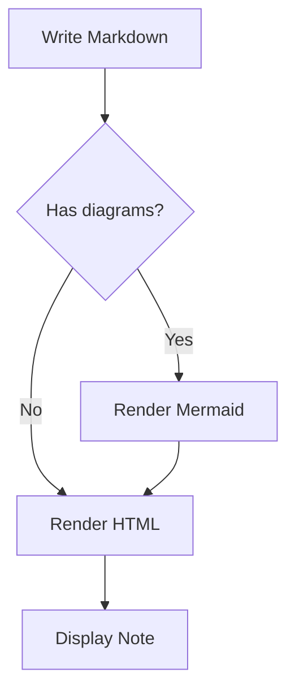
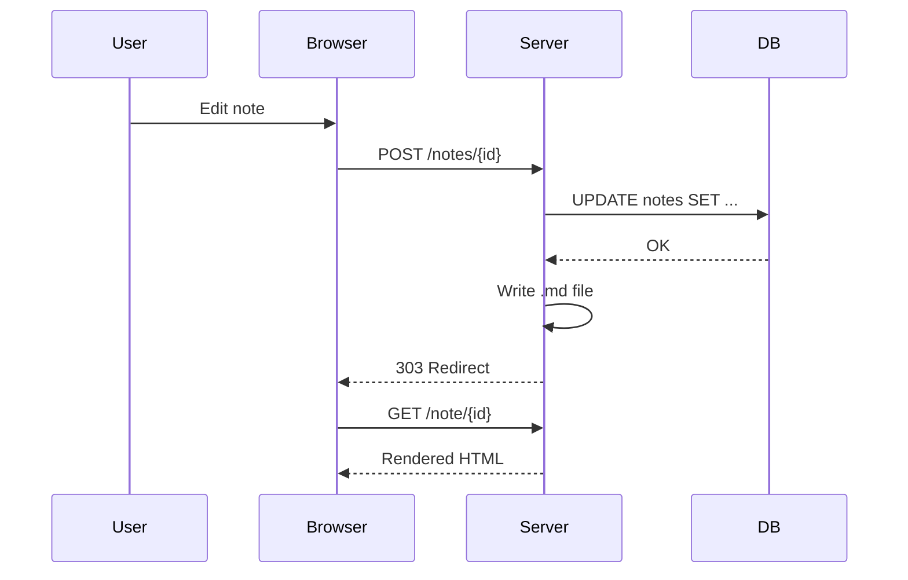
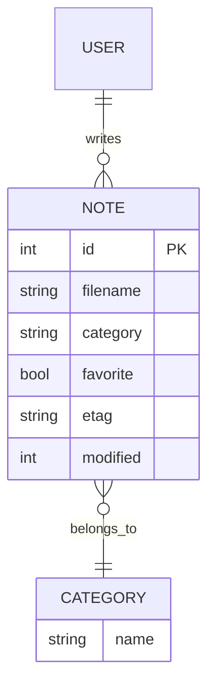
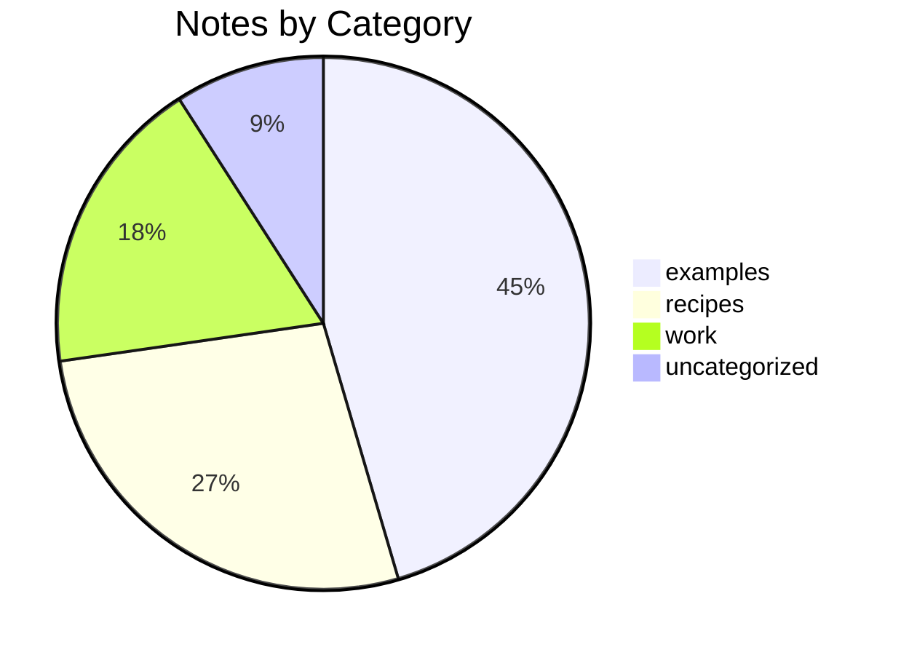

# Mermaid Diagrams

Diagrams are rendered using Mermaid. Use a fenced code block with language `mermaid`.

## Flowchart

```mermaid
flowchart TD
    A[Write Markdown] --> B{Has diagrams?}
    B -->|Yes| C[Render Mermaid]
    B -->|No| D[Render HTML]
    C --> D
    D --> E[Display Note]
```

## Sequence Diagram

```mermaid
sequenceDiagram
    participant User
    participant Browser
    participant Server
    participant DB

    User->>Browser: Edit note
    Browser->>Server: POST /notes/{id}
    Server->>DB: UPDATE notes SET ...
    DB-->>Server: OK
    Server->>Server: Write .md file
    Server-->>Browser: 303 Redirect
    Browser->>Server: GET /note/{id}
    Server-->>Browser: Rendered HTML
```

## Entity Relationship

```mermaid
erDiagram
    USER ||--o{ NOTE : writes
    NOTE {
        int id PK
        string filename
        string category
        bool favorite
        string etag
        int modified
    }
    NOTE }o--|| CATEGORY : belongs_to
    CATEGORY {
        string name
    }
```

## Pie Chart

```mermaid
pie title Notes by Category
    "examples" : 5
    "recipes" : 3
    "work" : 2
    "uncategorized" : 1
```
